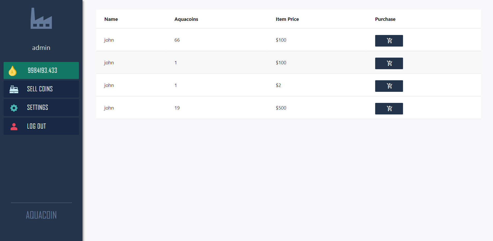

# AquaCoin_Boilermake2020

Original DevPost: https://devpost.com/software/aquacoin

## How to Run
Get a metamask wallet and get issued some aqua coin
run the web.py script to launch the server.
Then interact with the website!

## Inspiration
We wanted to not only build great tech, but also solve a real social problem like water sustainability. The best way to tackle water sustainability goals is to leverage the free market with government authority. Our application/coin was inspired by current discussions about Carbon Credits (a method to discourage air pollution by corporate actors). We wanted to put a price on water wastage and pollution

## What it does
The idea is that every corporation would be issued an equal number of Aqua Coins that are linked to a specific amount of waste. These companies are free to use water to fulfill their business goals as long as they have enough Aqua Coin. Companies that don't use all their Aqua Coins are able to use our public exchange to sell their tokens at an upcharge to companies who need to use more water.

We developed an online crypto-token exchange as a consequence of us building our own custom crypto-token called Aqua Coin. As a public Aqua Coin exchange, our app facilitates direct transfers of AQUA to and from external cryptocurrency wallets.

## Challenges we ran into
BLOCKCHAIN! We used blockchain as a financial tool, but it is extremely difficult technology to wrap our heads around its inner workings. Just being able to deploy a working and fully tradable cryptocurrency took a long time.

## What's next for AquaCoin
Time to revolutionize the world by creating a less wasteful planet.
